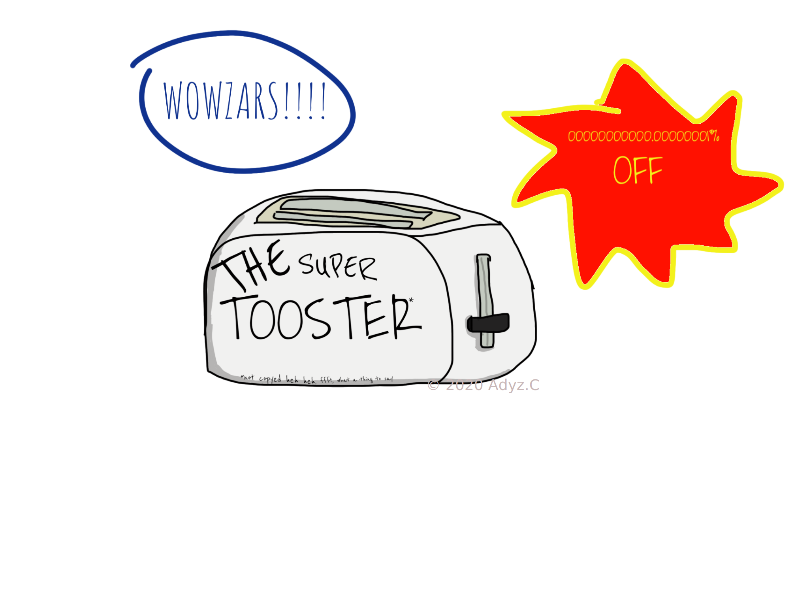
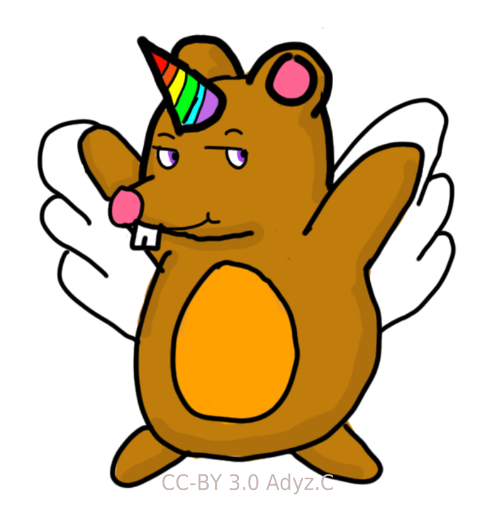

# Information Architecture

Let's go on an adventure into another world.
This world is not entirely different to our own, but it might have some unexpected treasures - and pitfalls - to find.
It's an adventure into the mind of your reader.
They live in our world, but they don't always think like we do.
And learning to think like a reader can be tricky!

Have you ever been really good at something, and tried to show someone else how to do it?
It's frustrating when they just don't seem to get it, even though it seems easy to you.
Science tells us that the more you know about a topic, the less you are able to imagine what it's like to not know it.
The technical name for this is the Curse of Knowledge, and it can make writing documentation hard.

Writers combat the Curse of Knowledge by putting themselves in the shoes of the reader.
And while this guide won't teach you to be a professional technical writer, it will definitely help you think about your reader, so that you can write better documentation.

Let's dive into ...

the world of the reader ...

## Don't start yet!

When you're excited about a new project, it's super-tempting to just start writing the docs without thinking too hard about it.

**DON'T DO THIS!**

This guide is designed to get you thinking about your readers in such a way that you'll end up knowing what docs you need to write.
It won't take very long for you to get through it, and it will save you time in the long run.

When you're done, you should have a good idea of who your main readers are, the kinds of things they are using your docs for, and what kinds of docs they might be expecting.
This will help you know which templates to use from the Good Docs Project, and give you the basics to start completing them.

If you want to do this using the interactive tool, go here instead: [Interactive IA Guide](don't click here the link does not exist yet).
The interactive version is the same as this static version, so you can use this version to check back on later on if you need to.

## What are you writing about?

The first thing to do is think about what you're writing about.

Are you writing about something pretty simple, that people can use without having any experience? Like a toaster?

Or are you writing about something a bit complicated, that people can start to use only after they've done a bit of reading, and might need to ask some questions as they go along? More like a car?

Or are you writing about something really tricky? Something that requires training, a whole lot of background knowledge, and possibly a friend to help them the whole way? Like a nuclear reactor?

**Curse of Knowledge alert!!**
> Try to remember that not everyone knows the same stuff, or learns in the same way.
> What if your reader doesn't speak the same language, or is a new migrant from a place with a totally different culture?
> What if they are nine years old?
> Or 99 years old?
> What if they have a physical or mental disability?
> When you are thinking about your readers, make sure you are thinking about everyone, not just people like you.

### Writing about a toaster

Because the thing you are writing about is pretty simple and straightforward, you might think that you don't need much documentation.

Just because you might not need a lot of docs, you will still need something, and working that out could be tricky.
You're going to need to think a little bit harder about who you're writing for.

### Writing about a car

There is a pretty good chance that you needed to learn how to do this thing yourself, and hopefully it wasn't all that long ago, and you can fairly easily cast your mind back to those days when you didn't know what this thing was, or how it worked.
And hopefully there is also someone nearby who has had to learn as well, so go ask them questions!

### Writing about a nuclear reactor

The first thing to work out if you are writing about a nuclear reactor is what reasonable assumptions can you make?
There's a fair chance that you can assume at least some kind of prior knowledge: a degree, some relevant experience, or perhaps using some other related tools or software.

Put these things right up front in your docs, so your readers can go away and learn something else first if they need to.
And be prepared to be challenged: you might discover in time that your assumptions are incorrect, and if that happens, you'll need to revisit your docs, too.

## Who are you writing for?

Now that you know what you're writing about, consider who you're writing for.
Remember that people come in all shapes and sizes, so let's think up three different people, to try and make sure we're covering all the options.

The way you categorize your three readers is up to you, but sometimes the best way to start is by thinking of a beginner, an intermediate reader, and an expert.
Or, depending on the kind of product you have, you might think of an ordinary user, a system administrator, and a support person.

Your three readers should probably be interested in different parts of your product.
They will be trying to do different tasks, and they will need different levels of help from your docs.
Don't be afraid to let them overlap a little bit, but try and make sure you've covered most of the options.

Let's take a closer look at our readers, and work out why they read the docs.

I'm going to tell you a secret:

*No one curls up at night with a warm drink and a great technical manual.*

If that's the case, why **do** people read docs?
Generally speaking, it's because they want to achieve something.

To put that in less abstract terms, you need to work out what problem your reader is trying to solve.
If Dusty wants to put their degree up on the wall, they might want to consult some documentation about how to do it.
The documentation Dusty needs to do this would probably not be called "How to Choose a Drill".
The documentation Dusty needs is "How to Hang a Picture".

This is an important distinction, because if you get it wrong, your readers won't know if the content is right for them or, worse, they won't find your content at all.

So let's think about what our readers are trying to achieve.

For each of your readers, start by thinking about how they might begin.
What is the very first thing they might want to do?
Let's assume that they manage to complete that without any trouble.
What would be the second thing that they would want to do?
And now that they've managed to complete that what is the next thing?

When you've got tasks for all of your readers, let's put it all together.

## Writing for your readers

Now that you know who your readers are, and the kinds of things they might be using your documentation for, you can display them in a table like this:

<table>
    <tr>
        <th>Tasks</th>
        <th>Reader 1</th>
        <th>Reader 2</th>
        <th>Reader 3</th>
        <th>Critical Path Score</th>
    </tr>
    <tr>
        <td>Task 1</td>
        <td></td>
        <td></td>
        <td></td>
        <td></td>
    </tr>
    <tr>
        <td>Task 2</td>
        <td></td>
        <td></td>
        <td></td>
        <td></td>
    </tr>
    <tr>
        <td>Task 3</td>
        <td></td>
        <td></td>
        <td></td>
        <td></td>
    </tr>
    <tr>
        <td>Task 4</td>
        <td></td>
        <td></td>
        <td></td>
        <td></td>
    </tr>
    <tr>
        <td>Task 5</td>
        <td></td>
        <td></td>
        <td></td>
        <td></td>
    </tr>
    <tr>
        <td>Task 6</td>
        <td></td>
        <td></td>
        <td></td>
        <td></td>
    </tr>
    <tr>
        <td>Task 7</td>
        <td></td>
        <td></td>
        <td></td>
        <td></td>
    </tr>
    <tr>
        <td>Task 8</td>
        <td></td>
        <td></td>
        <td></td>
        <td></td>
    </tr>
    <tr>
        <td>Task 9</td>
        <td></td>
        <td></td>
        <td></td>
        <td></td>
    </tr>
</table>

Now you just need to fill in the blank spaces.
Consider how likely the reader is to use the documentation to complete each task.
Score a **1** for a low likelihood, **2** for a medium likelihood, and **3** for a high likelihood.

**Curse of Knowledge alert!!**
> Remember that this isn't how likely the reader is to do the task.
> It's how likely the reader is to *use the documentation* to do the task.
> A really experienced reader is not likely to need to the documentation for tasks like installation or setup, but they might need it for more advanced tasks.

When you have the numbers in, add up each row.
The rows that score the highest are what writers like to call *critical paths*.
The items with the highest critical path score is the content that is most important for you to write.

## Identify the mess

It's time to turn our attention to what you already have.
If you have already made a start on the docs, that's great!
But even if you think you're starting from scratch, there's a reasonable chance you actually already have something.

Have a think about it:

* Have you written notes while you've been working?
    Even if they're just scratches on a notebook on your desk, that's documentation!
* Have you written any comments in your code?
    You really should have! They're documentation, too.
* Have you put a README in your code repository?
    That's also documentation!
* Have you given any talks or presentations about your project?
    Even if there isn't a recording, any notes or slides you made is documentation too!

Get all of these things together and look at them with your critical paths in mind.
Do you have content here that fits all those critical paths?

You will probably start to notice the gaps pretty quickly.
It could be that you have a whole lot of content that describes how to do it, but not a lot that explains what it is.
Or, you could have a lot of stuff aimed at beginners, and not a lot that works for experts.
Sometimes, you might find that you have a lot of descriptions of things, but not a lot of step-by-step instructions.

## What's missing?

Have a think about each of your critical paths, and identify what content you need to fulfil each one.

At this stage, it's normal to be feeling a little overwhelmed.
Now you can work out what you actually need, so you can cut some things from the list.

## State your intent

If you wanted to build a house, you wouldn't start laying bricks until you'd had a think about what kind of house you want to build.
How big is it going to be?
What materials are you going to use?
What layout and design is it going to have?

You also need to think about what you intend for your documentation.
Is it going to be comprehensive and detailed, or simple and sparse?
Is it going to use simple language, designed for people who have never done this before, or more technical language, for people who know what they're doing and just need the basics?
Is it going to start from the very beginning, or are you going to assume that your readers already have some knowledge?

## Face reality

By now, you should have a good idea of what your ideal documentation looks like.
It will be a shining beacon of docs goodness, hitting all the critical paths for all your readers, and people will talk about it for years to come!

It's a grim reality that project documentation needs to be maintained.
Have a think about how many writers your project might be able to access.
Are you likely to have writers on the project over time?
What skill level are they likely to have?
Is there any content that already exists elsewhere that you can point to, rather than writing it yourself?
Is there any way you can automate any part of the documentation, such as using code comments to generate API documentation?

## Choose a direction

Now is when you really get to start making decisions.
You've thought about your readers, and the kinds of things they might want to do.
You've thought about the kind of content you already have, and what's missing.
Then you faced reality and realized that you might not be able to create perfect docs, but you can certainly improve what you already have.

So, which docs are you going to write?

Now you get to decide how to move forward.

## Measure the distance

Don't let your docs project be like your New Year resolutions, forgotten and lonely by the end of the year.
The best way to make sure you stick to your docs goals, is to work out how much you can do, and set a deadline for each step in the process.

The templates will help you understand how much work is involved in each of the docs you want to write.
Have a read through the information for each template you want to use, and work out how much time you are going to need to work on it.

Then you can split up docs work like this:

* Planning - 20%
* Drafting - 50%
* Reviewing and editing - 20%
* Production - 10%

So, if you want to write a How To, and you have five months to do it, you can work out how much time to spend on each task like this:

Three months = Around 100 working days, not counting weekends, and allowing for a few holidays.
You can adjust this however you like, if you're only working on weekends, for example, or if you have other projects to work on as well.

* Planning - 20 days (4 weeks)
* Drafting - 50 days (10 weeks)
* Review & edit - 20 days (4 weeks)
* Production - 10 days (2 weeks)

There's just one more thing to do.

## Prepare to adjust

The most important thing you need to do is to be flexible.
Things don't always work out, and that's OK!

Perhaps you get a new job and end up with no time to work on things.
If you've written down your plan, and spoken to others in your project about what you were going to do, others can pick up the work, and when you're able to, you can come back to it.

Perhaps you get an injection of cash and can hire some writers.
Go back to the critical paths, expand your scope, and hand that planning to them, so that they have somewhere to start, and understand your vision for the docs.

Or maybe things just don't work out, and the project ends up being abandoned entirely.
That's sad, but it's OK.
At least you've finished up with some valuable knowledge, so you'll be even better for your next idea.

So, are you ready to get started?

Go [check out the templates](https://github.com/thegooddocsproject/templates/blob/master/README.md)!

## Further Reading

This document was largely based on the brilliant book by Abby Covert called [How to Make Sense of Any Mess](http://www.howtomakesenseofanymess.com/).
It's a quick read, and it doesn't just apply to technical documentation, you can use the principles in that book to help you organize anything at all.

If you want to delve further into information architecture for technical documentation, the most important text you need is the O'Reilly book [Information Architecture](https://www.oreilly.com/library/view/information-architecture-4th/9781491913529/).
It has everything you need to know, including answers to questions you didn't know you needed to ask.
It has a polar bear on the cover.

## That's it!

You've reached the end of the static Information Architecture Guide.
If you're ready to get started, go [check out the templates](https://github.com/thegooddocsproject/templates/blob/master/README.md)

If you want to try the interactive version of this guide, visit the [interactive IA Guide](don't click here the link does not exist yet).
